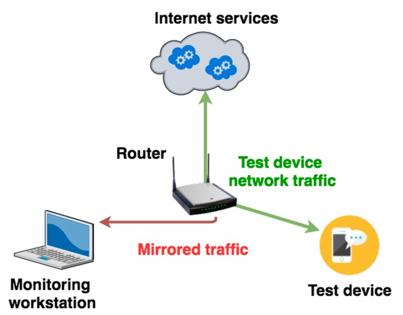

# tshark notes

- tshark is cli for wireshark
- `"tcp.flags.syn==1 or (tcp.flags.syn==1 and tcp.flags.ack==1)"` = display filter for syn, syn ack packets
- useful flags: 
  - `-l` flushes STDOUT after every packcet
  - `-Y` display filter
  - `-n` disables name resolution

## monitoring logs
- `tail -f <file name>`
- `less +F <file name>`

## Mirroring traffic to analyze
To analyze remote traffick you must set up router to forward traffick from test device to a monitoring device. To do this you must set up iptable rules.

1. add ssh key for passwordless auth
2. install iptables-mod-tee package: `opkg install iptables-mod-tee`
3. check install with: `opkg list-installed | grep "mod-tee"`
4. run by `modprobe xt_TEE`

Next set up iptable rules to forward all upstream and downstream test device packets to monitoring workstation.

iptable rules: 
- `iptables -A PREROUTING -t mangle -i br-lan ! -d <TEST_DEVICE_IP_ADDRESS> -j TEE --gateway <MONITORING_WORKSTATION_IP_ADDRESS>`
- `iptables -A POSTROUTING -t mangle -o br-lan ! -s <TEST_DEVICE_IP_ADDRESS> -j TEE --gateway <MONITORING_WORKSTATION_IP_ADDRESS>` 

Now traffick should be sent from test device to monitoring station.

The setup looks like:

